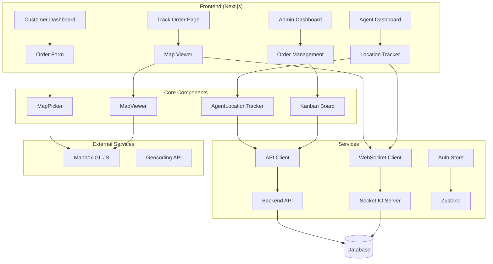

# Order Tracker Frontend


## 🌐 Live Deployment

**Live Demo**: [https://order-tracker-frontend-tau.vercel.app/](https://order-tracker-frontend-tau.vercel.app/)

## 📝 Assignment Overview

This project showcases a complete order tracking solution with the following technical implementations:

- **Real-time Order Tracking**: Live location updates and status synchronization
- **Interactive Maps**: Mapbox integration with dynamic route visualization  
- **Role-based Architecture**: Multi Role system with Admin, Agent interfaces
- **WebSocket Integration**: Real-time bidirectional communication using Socket.IO
- **Responsive Design**: Mobile-first UI with modern design patterns
- **State Management**: Optimistic updates and real-time state synchronization

## 🎯 Technical Highlights

- **Modern React Patterns**: App Router, Server Components, and TypeScript
- **Real-time Features**: WebSocket integration with optimistic UI updates
- **Map Integration**: Complex geospatial features with route calculation
- **Authentication**: JWT-based auth with role-based access control
- **UI/UX**: Professional interface with smooth animations and micro-interactions

## 📋 Setup Instructions

### Prerequisites

- Node.js 18+ and npm/yarn/pnpm
- Mapbox API key
- Backend API server running

### Installation

1. **Clone the repository**

   ```bash
   git clone https://github.com/abhisek-kar/order-tracker-frontend.git
   cd order-tracker-frontend
   ```

2. **Install dependencies**

   ```bash
   npm install
   # or
   yarn install
   # or
   pnpm install
   ```

3. **Environment Configuration**

   Create a `.env.local` file in the root directory:

   ```env
   NEXT_PUBLIC_API_BASE_URL=http://localhost:5000
   NEXT_PUBLIC_MAPBOX_TOKEN=your_mapbox_access_token_here
   ```

4. **Run the development server**

   ```bash
   npm run dev
   # or
   yarn dev
   # or
   pnpm dev
   ```

5. **Open the application**

   Navigate to [http://localhost:3000](http://localhost:3000) in your browser.

## 🔑 Test Credentials

For testing the application, use these pre-configured accounts:

### Admin Access
- **Email**: `admin@tracker.com`
- **Password**: `Admin@123`
- **Features**: Full order management, Kanban board, analytics dashboard

### Agent Access
- **Email**: `agent@tracker.com`
- **Password**: `Agent@123`
- **Features**: Order tracking, location updates, delivery management

> **Note**: These are test credentials for demonstration purposes. In production, proper user registration and secure password policies should be implemented.

### Build for Production

```bash
npm run build
npm run start
```

## 🏗️ Architecture Diagram



## 🔗 API Endpoints

### Authentication

- `POST /api/v1/auth/login` - User login

### Orders

- `GET /api/v1/orders` - Get all orders
- `POST /api/v1/orders` - Create new order
- `GET /api/v1/orders/:id` - Get order by ID
- `PATCH /api/v1/orders/:id/status` - Update order status
- `PATCH /api/v1/orders/:id/location` - Update agent location

### WebSocket Events

- `agent_location_update` - Real-time agent location updates
- `order_status_update` - Real-time order status changes
- `join_order_room` - Join order-specific room for updates

## 📱 Screenshots & User Flow

### 1. **Homepage & Order Creation**

```
[Home] → [Place Order] → [Fill Details] → [Select Location] → [Order Success]
```

### 2. **Order Tracking Flow**

```
[Track Order] → [Enter Order ID] → [View Map] → [Real-time Updates]
```

### 3. **Agent Workflow**

```
[Agent Login] → [Dashboard] → [Order Details] → [Location Tracking] → [Status Updates]
```

### 4. **Admin Management**

```
[Admin Login] → [Dashboard] → [Kanban Board] → [Drag & Drop Status] → [Order Details]
```

## 🛠️ Tech Stack

- **Framework**: Next.js 15 with App Router
- **Language**: TypeScript
- **Styling**: Tailwind CSS + shadcn/ui
- **Maps**: Mapbox GL JS
- **Real-time**: Socket.IO Client
- **State Management**: Zustand
- **Forms**: React Hook Form + Zod
- **Animations**: Framer Motion
- **HTTP Client**: Axios

## 📁 Project Structure

```
├── app/                    # Next.js App Router
│   ├── admin/             # Admin dashboard pages
│   ├── agent/             # Agent dashboard pages
│   ├── login/             # Authentication
│   └── order/             # Order creation & tracking
├── components/            # Reusable components
│   ├── forms/            # Form components
│   ├── map/              # Map-related components
│   ├── sections/         # Layout sections
│   └── ui/               # shadcn/ui components
├── hooks/                # Custom React hooks
├── lib/                  # Utilities & configurations
└── public/               # Static assets
```

## 🔐 User Roles & Permissions

### Agent

- View assigned orders
- Update order status
- Share live location during delivery
- Simulate movement for testing

### Admin

- Manage all orders via Kanban board
- View real-time analytics
- Monitor agent locations
- Drag-and-drop status updates

## 🚀 Deployment

### Live Application

The application is deployed and accessible at: **[https://order-tracker-frontend-tau.vercel.app/](https://order-tracker-frontend-tau.vercel.app/)**


### Environment Variables

Ensure the following environment variables are set in your deployment platform:

```env
NEXT_PUBLIC_API_BASE_URL=your_production_api_url
NEXT_PUBLIC_MAPBOX_TOKEN=your_mapbox_access_token
```


